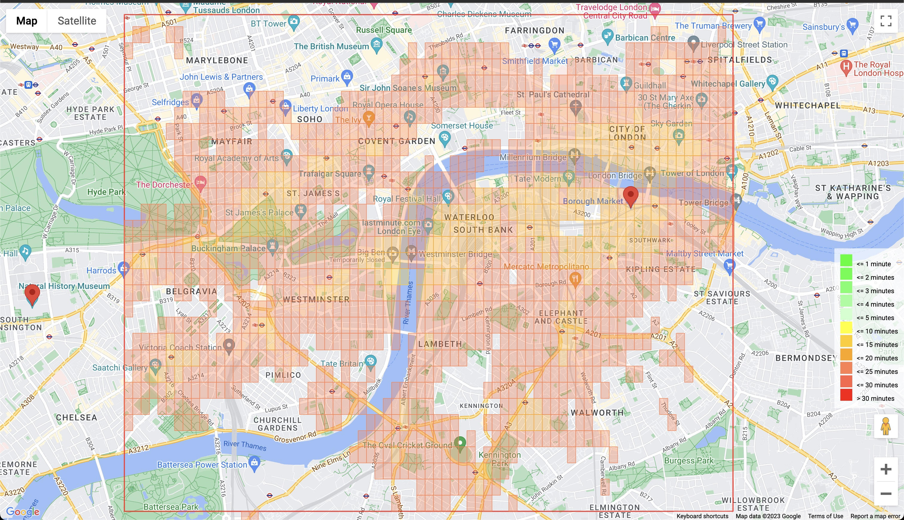

Commute Time Heatmap

This project generates a heatmap of commute times for different locations within a specified polygon area. The heatmap is based on the average commute times to multiple destinations. The project uses the Google Maps API to get the distance matrix data and visualize the heatmap.

## Results



## Installation and Setup

1. Clone the repository and navigate to the project folder.
2. Install the required dependencies using the following command:

```bash
npm install
```

3. Create a `.env` file in the project root directory with the following content:

```text
GOOGLE_MAPS_API_KEY=<your_google_maps_api_key>
```

Replace `<your_google_maps_api_key>` with your own Google Maps API key.

4. Modify the `polygonRawCoords` and `destRawCoords` arrays in the `generateCommuteTimes.js` file to define the polygon area and the destination coordinates. Optionally, also set the tile resolution (more details below).

5. Run the following command to generate the commute times data:

```bash
node generateCommuteTimes.js
```

6. Run the following command to start local server:

```bash
node server.js
```

7. Open `http://localhost:3000` (or whatever port you have set up) in your browser to see the heatmap.

### Tile Resolution

Tile resolution determines the size of the rectangular tiles that make up the heatmap. The lower the tile resolution value, the smaller the tiles will be. A smaller tile size means a more precise heatmap, but it may require more API calls and processing time. You can adjust the tile resolution in the `generateCommuteTimes.js` file by changing the value of the `tileResolution` variable. You will also have to adjust it in `script.js` to display it correctly.

After changing the tile resolution, you need to rerun the `generateCommuteTimes.js` script and refresh the browser to see the updated heatmap.